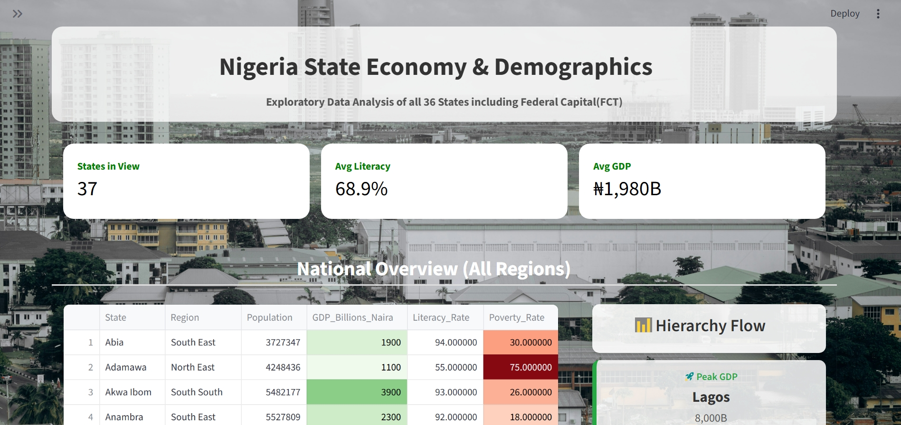

````markdown
# 🇳🇬 Nigeria Economic Dashboard (Glass UI)

A modern, interactive data dashboard exploring the economic and demographic data of Nigeria's 36 states and the FCT. This project demonstrates advanced **Streamlit layout techniques**, custom **CSS styling (Glassmorphism)**, and logic-based data filtering.


## ✨ Features

* **🎨 Glassmorphism Design:** Custom CSS implementation for a modern, transparent "frosted glass" user interface.
* **📊 Smart Rankings:** Instantly sort states by **GDP (Rich vs Poor)**, **Literacy**, or **Poverty Rates**.
* **🗺️ Regional Filtering:** Interactive sidebar to filter data by Geopolitical Zones (e.g., North West, South West).
* **📉 Hierarchy Flow:** A custom visual component that calculates and displays the "Gap" between the top-performing and lowest-performing states in real-time.
* **📱 Responsive Layout:** Optimized 2-column design with specific mobile-friendly metric cards.

## 🛠️ Tech Stack

* **Core:** Python
* **Frontend:** Streamlit
* **Data Processing:** Pandas
* **Styling:** Custom CSS (Injected via Streamlit)

## 📂 Project Structure

```text
nigeria-dashboard/
│
├── .venv/                 # Virtual environment
├── app.py                 # Main dashboard application (Glass UI version)
├── nigeria_data.py        # Database file (Contains list of 37 states)
├── background.jpg         # Background image for the glass effect
├── pyproject.toml         # Dependencies
└── README.md              # Project documentation
````

## 🚀 Getting Started

### 1\. Prerequisites

  * Python installed
  * `uv` installed (recommended) or standard `pip`

### 2\. Installation

```bash
# Clone the repository
git clone (https://github.com/manaly9/nigeria_lr_pr.git)
cd nigeria-dashboard

# Install dependencies using uv
uv init
uv add streamlit pandas
```

*(Note: You must have a file named `background.jpg` in your folder for the UI to work correctly).*

### 3\. How to Run

Execute the app using `uv`:

```bash
uv run streamlit run app.py
```

The dashboard will open automatically in your browser at `http://localhost:8501`.

## 🎨 CSS Customization

This project relies heavily on `st.markdown` to inject CSS. Key styles used:

  * **`backdrop-filter: blur(10px)`**: Creates the frosted glass effect.
  * **`rgba(255, 255, 255, 0.9)`**: Sets semi-transparent white backgrounds.
  * **`!important` overrides**: Used to force Streamlit's default containers to accept custom styling.

## Dashboard Display


## 🤝 Acknowledgements

  * Data represents a snapshot of economic estimates for educational analysis.
  * Built as part of an Intermediate Data Science portfolio progression.

<!-- end list -->

```
```